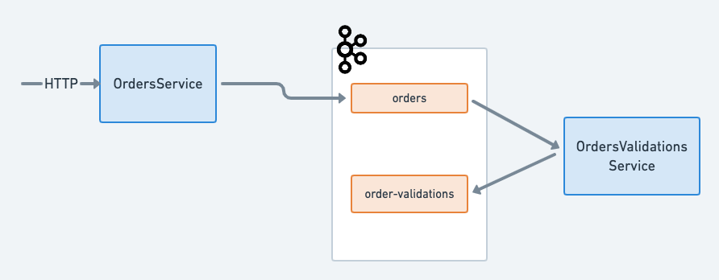

# streamapp-a

### Introduction

Build of a Reactive, Event-Driven e-commerce application as detailed in [this link](https://docs.confluent.io/current/tutorials/examples/microservices-orders/docs/index.html?_ga=2.203721232.144266676.1568256424-250089943.1568087216).

### Architecture Diagram

Architecture Diagram of components that are in development. The diagram will be updated as soon as the further components are in development.

### Tech Stack
* Confluent Cloud (Kafka)
* Kafka (Docker)
* Kafka Connect
* Kafka Streams
* Akka-Http
* Debezium Postgres
* Docker Compose

### Sources, Inspirations

* _Designing Event Driven Systems_ by Ben Stopford
* _Designing Data-Intensive Applications_ by Martin Kleppmann
